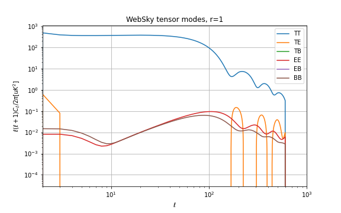

.. _websky:

WebSky
******

The Websky suite of simulated extragalactic component maps, determined from large scale structure light cone realizations and  based on Lagrangian perturbation theory, Peak Patch Lagrangian halo finding, and modeling of SZ and CIB effects, can be read into PySM as precomputed external fits files using InterpolatingComponent.  More information on the Peak Patch halo finding method can be found in `Stein, Alvarez, and Bond (2018) <https://arxiv.org/abs/1810.07727>`_, and selected maps and halo catalogs are available from the `Websky website <http://mocks.cita.utoronto.ca/websky>`_. Some additional Websky-specific information and tools are available at the `SO Websky model repository <https://github.com/simonsobs/websky_model>`_.

The cosmological parameters used for the websky simulations are available at `on the websky website <https://mocks.cita.utoronto.ca/data/websky/v0.0/cosmology.py>`_.

Cosmic Infrared Background
--------------------------

The Planck (2013) CIB halo model is used, along with a halo occupation distribution. More details can be found `here <https://github.com/simonsobs/websky_model>`_. 

The current version of the maps are of intensity in units of :math:`MJy/Sr` with filename convention ``cib_nu[FREQ].fits`` e.g. ``cib_nu0027.fits`` is the map of CIB intensity at 27 GHz and will be used by :py:class:`~pysm3.InterpolatingComponent` at that frequency, and can be found on NERSC at `/global/project/projectdirs/cmb/www/pysm-data/websky/0.4` or at https://portal.nersc.gov/project/cmb/pysm-data/websky/0.4/.

Radio Galaxies
--------------

Emission from Radio Galaxies simulated by WebSky 0.4, the orignial maps are avaiable at https://portal.nersc.gov/project/sobs/users/Radio_WebSky/matched_maps/ in CAR and HEALPix format.
For more information about abundance matching in the relevant paper at https://arxiv.org/abs/2110.15357.

Thermal SZ Effect
-----------------

Provided is a map of the Compton-y parameter and is based on Battaglia et al. (2012) pressure profiles, and can be found at `/project/projectdirs/cmb/pysm-data/websky/0.4/tsz_8192_hp.fits`.

Kinetic SZ Effect
-----------------

Provided is a map of the temperature fluctuation due to line of sight peculiar velocities of electrons along the line of sight. Electrons are assumed to follow a Navarro Frenk and White (NFW) profile interior to halos and second order Lagrangian Perturbation Theory (LPT) outside. The ksz map can be found at `/project/projectdirs/cmb/pysm-data/websky/0.4/tsz.fits`

Lensing Convergence
-------------------

A lensing convergence map is generated from the simulated matter distribution along the line of sight, assumed to follow an NFW profile interior to halos and second order LPT outside. 

Primary and lensed CMB
----------------------

The convergence map is used to lens a Gaussian realization of the unlensed primary CMB, which is then read into PySM as the primary lensed CMB through the :py:class:`~pysm3.WebSkyCMB` class.
The primary CMB is obtained from parameters that match the Websky simulation, namely A_s = 2.022e-9, tau = 0.055, and all other parameters set to the websky values above, see `the code <https://github.com/ajvanengelen/webskylensing/blob/master/py/get_cmb_powerspectra.py>`_, values not explicitely set are equal to the CAMB default, for example :math:`N_{eff}=3.046`. The CAR maps (where the lens remapping is done) have 1 arcminute resolution.

For convenience, see the parameters below:

.. math::
   :nowrap:

   \begin{aligned}
   & \Omega_b = 0.049 \\
   & \Omega_c = 0.261 \\
   & \Omega_m = \Omega_b + \Omega_c \\
   & h = 0.68 \\
   & n_s = 0.965 \\
   & A_s = 2.022 e^{-9} \\
   & N_{eff} = 3.046 \\
   & \tau = 0.055
   \end{aligned}

The theoretical power spectra for the unlensed and lensed CMB are available here https://github.com/ajvanengelen/webskylensing/tree/master/data.  Each is a numpy array of shape `(3, 3, N_l)`, giving the theory power spectrum C_l's in the order ((TT, TE, TB), (ET, EE, EB), (BT, BE, BB)) in units of uK_CMB^2.  They are obtained from the `get_cmb_powerspecta.websky_cmb_spectra` routine in that repository, which serves as a wrapper to CAMB.

**CMB Tensor not yet implemented in PySM 3**

The :py:class:`WebSkyCMBTensor` provides the $BB$ spectrum for the Websky cosmology from a model with $r = 1$ (which of course needs to be scaled to whatever actual $r$ value we want to use). This component is not lensed.
The tensor spectral index ($n_t$) in CAMB was set to 0.
   
The $C_\ell$ from CAMB has power only up to $\ell = 600$, however, given that the primordial BB signal is suppressed on scales smaller than the horizon scale at decoupling this should not matter in practice, for more details see `this Github issue <https://github.com/simonsobs/so_pysm_models/issues/48#issuecomment-628397058>`_

